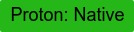
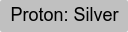
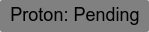
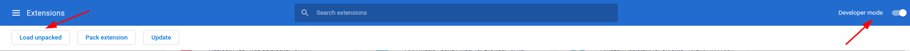

# ProtonDB extension for Chrome

This extension fetches the proton rating from protondb and displays it & a link to the protondb page nicely by the title of the game. This lets you know how well the game will preform utilizing steams proton layer.
### The proton rankings are as such:

## The rating shows up on the Steam game's store page.

 

## To Install:
### Chrome Webstore
 - Go to the [extension's store page](https://chrome.google.com/webstore/detail/protondb-for-steam/ngonfifpkpeefnhelnfdkficaiihklid)
 - Press the button 'add to chrome'. 
### Manually
 - Download / clone the source code with `git clone https://github.com/MostwantedRBX/proton-chrome-extension.git`
 - Go to the url `chrome://extensions`
 - Enable "Developer Mode" in the top right of the screen
 - Select "Load Unpacked" in the top left of the screen and point it to the src folder in the cloned repository.
 
