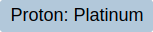
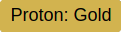
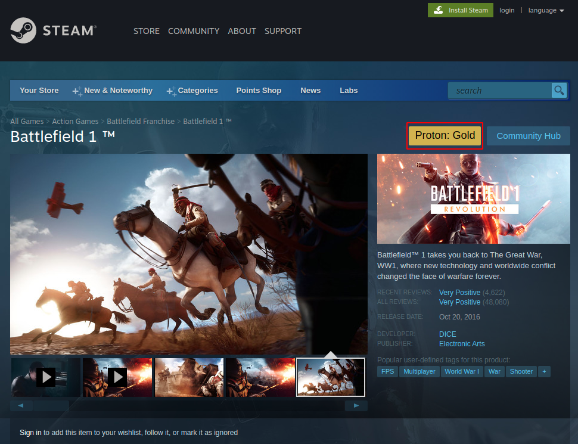

# ProtonDB extension for Chrome
This extension fetches the proton rating from protondb and displays it & a link to the protondb page nicely by the title of the game. This lets you know how well the game will preform utilizing steams proton layer. 

NOTE: It does not currently say whether it is native or not. That will be added later.

### The proton rankings are as such:

### . . . silver and bronze

### . . . pending

## The rating shows up on the Steam game's store page.

