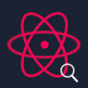
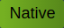

<div align="center">
    <a href="https://chrome.google.com/webstore/detail/protondb-for-steam/ngonfifpkpeefnhelnfdkficaiihklid" target="_blank" title="Download on the chrome webstore"></a>
    <a href="https://addons.mozilla.org/en-US/firefox/addon/protondb-steam" target="_blank" title="Download on the firefox addon store"></a>
    <a href="https://github.com/MostwantedRBX/proton-chrome-extension/releases/latest" target="_blank" title="Download latest release"></a>
    <!-- Edge badge is not yet available om shields.io-->
    <a href="LICENSE" target="_blank" title="License"></a>

</div>
<br />
<div align="center">
  <a href="https://github.com/MostwantedRBX/proton-chrome-extension">
    
  </a>

<h3 align="center">ProtonDB For Steam</h3>

  <p align="center">
    Show protondb badges on the steam store!
    <br />
    <br />
    <a href="https://github.com/MostwantedRBX/proton-chrome-extension/issues" target="_blank">Report Bug</a>
    ·
    <a href="https://github.com/MostwantedRBX/proton-chrome-extension/issues" target="_blank">Request Feature</a>
  </p>
</div>


## About the project
This extension fetches the proton rating from protondb and displays it & a link to the protondb page nicely by the title of the game. This lets you know how well the game will preform utilizing steams proton layer.
  
Upon installing the addon, you'll see proton ratings:
- On a game's store page
- On the search box, when searching for games
- On the search results page
- On the front page <sup>COMING SOON</sup>

## Screenshots


### The proton rankings are as such:
<table>
<tr>
<th>Rating</th>
<th>Badge</th>
<th>Color</th>
</tr>

<tr>
<td>Native</td>
<td></td>
<td>Green</td>
</tr>

<tr>
<td>Platinum</td>
<td></td>
<td>Silver</td>
</tr>

<tr>
<td>Gold</td>
<td></td>
<td>Gold</td>
</tr>

<tr>
<td>Silver</td>
<td></td>
<td>Silver</td>
</tr>

<tr>
<td>Bronze</td>
<td></td>
<td>Bronze</td>
</tr>

<tr>
<td>Borked</td>
<td></td>
<td>Red</td>
</tr>

<tr>
<td>Pending</td>
<td></td>
<td>Gray</td>
</tr>
</table>

<br />

## Getting Started
### Installing via the Chrome Webstore
 - Go to the [extension's store page](https://chrome.google.com/webstore/detail/protondb-for-steam/ngonfifpkpeefnhelnfdkficaiihklid)
 - Press the button 'add to chrome'. 
### Installing via the Firefox Addons
- Go to the [addon store page](https://addons.mozilla.org/en-US/firefox/addon/protondb-steam)
- Click the button 'add to firefox'.
### Installing via the edge addons
- Go to the [addon store page](https://microsoftedge.microsoft.com/addons/detail/protondb-for-steam/efggpghjemjhldhoemgijjpnajcidcni)
- Press the button 'get'.
### Installing Manually (Chrome-based browsers only!)
 - [Download the latest release](https://github.com/MostwantedRBX/proton-chrome-extension/releases/latest)
 - Go to the extensions page: ```chrome://extensions```
 - Drop the downloaded zip into the extension page

## Contributing
Missing any features, experiences issues or have any other feedback? <a href="https://github.com/MostwantedRBX/proton-chrome-extension/issues" target="_blank">Submit an issue!</a>

Rather contribute yourself? Feel free!
1. Fork the Project
2. Create your Feature Branch (`git checkout -b feature/AmazingFeature`)
3. Commit your Changes (`git commit -m 'Add some AmazingFeature'`)
4. Push to the Branch (`git push origin feature/AmazingFeature`)
5. Open a Pull Request


## License
 This project is licensed under the MIT license. Check [LICENSE](LICENSE) for more information.

